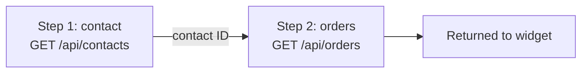

# Build a Composite Connector

Chain multiple API calls into a single execution when your widget needs data that requires more than one request — for example, looking up a record in one call, then using its ID to fetch related data in the next. This guide covers how to define, execute, and debug **composite connectors**.

## Prerequisites

* A repository with `connectors_registry.json` already set up. See [Repository Registry](repository-registry).
* Familiarity with regular connector configuration. See [Build Your First Connector](build-first-connector).

## How execution flows



Steps run sequentially — step 2 waits for step 1 to complete. If any step fails with an HTTP 4xx/5xx or network error, execution stops immediately and the final response is an error. The response returned to the widget is always the **last step's response**.

## Define a composite connector

To create a composite connector, add an entry under the `composite_connectors` array in your `connectors_registry.json`. Each step is a connector definition that can attach its own authentication and read values from earlier steps' responses. In the example below, both steps sign themselves in, and step 2 reuses the `id` returned by step 1 (authentication and value-passing are explained in the sections that follow):

```json
{
  "connectors": [...],
  "composite_connectors": [
    {
      "name": "Contact Orders",
      "permalink": "contact-orders",
      "steps": [
        {
          "name": "contact",
          "url": "https://api.example.com/contacts",
          "method": "GET",
          "query_parameters": [
            {"key": "email", "value": "{{ user.email }}"}
          ],
          "authentication": {
            "type": "oauth_client_credentials",
            "config": {
              "client_id": "{{ get_secret('oauth_client_id') }}",
              "client_secret": "{{ get_secret('oauth_client_secret') }}",
              "token_url": "https://auth.example.com/oauth/token"
            }
          }
        },
        {
          "name": "orders",
          "url": "https://api.example.com/orders",
          "method": "GET",
          "query_parameters": [
            {"key": "contact_id", "value": "{{ (steps.contact.body | from_json).id }}"}
          ],
          "authentication": {
            "type": "oauth_client_credentials",
            "config": {
              "client_id": "{{ get_secret('oauth_client_id') }}",
              "client_secret": "{{ get_secret('oauth_client_secret') }}",
              "token_url": "https://auth.example.com/oauth/token"
            }
          }
        }
      ]
    }
  ]
}
```

The `client_id` and `client_secret` values reference [Secrets and Variables](secrets/) you store first — `get_secret('oauth_client_id')` looks up a Secret by the name you chose, not the credential itself. Replace the example hosts with your API's.

Push the file to your watched branch. The platform syncs the composite connector automatically — the same way it syncs regular connectors.

Put any step value that contains spaces or special characters — such as a search query — in the step's `query_parameters` rather than inline in the `url`. See [Headers & Query Parameters](headers-and-query-parameters#values-with-spaces-or-special-characters).

::: info Composite connectors have no admin UI
You can only create and edit composite connectors through your repository registry. There is no visual editor for them.
:::

For the full list of step fields and variables, see [Composite Connector Reference](composite-connector-reference).

## Which fields support templating

Jinja2 templates render in every templated step field: `url`, each `headers[].value`, each `query_parameters[].value`, the `authentication` config values, `request_body`, and `response_body`. The `name`, `method`, and `response_content_type` fields are literal — they are never evaluated as templates. For `headers` and `query_parameters` entries, only the `value` is templated; the `key` is always literal.

See [Step fields](composite-connector-reference#step-fields) for the complete field reference.

## Authenticate each step

Each step signs in on its own. Attach an `authentication` block to every step that calls a secured API, and the platform handles that step's credentials for you, using the same options as regular connectors. For OAuth types it requests the access token, caches it, and injects it as a `Bearer` header automatically. See [Authentication](authentication) for every supported type.

```json
{
  "name": "orders",
  "url": "https://api.example.com/orders",
  "method": "GET",
  "authentication": {
    "type": "oauth_client_credentials",
    "config": {
      "client_id": "{{ get_secret('oauth_client_id') }}",
      "client_secret": "{{ get_secret('oauth_client_secret') }}",
      "token_url": "https://auth.example.com/oauth/token"
    }
  }
}
```

::: warning Don't build a manual token step
Don't add an extra step just to log in — each step logs itself in. A separate step that calls the token endpoint by hand duplicates the sign-in the `authentication` block already performs, and that manual token request typically fails with `grant type not supported`. Attach `authentication` to the step that needs it instead.
:::

The platform caches each OAuth token until it expires and reuses it across steps whose credentials resolve to the same client ID, secret, token URL, and scope — so repeating the same `authentication` block across steps costs one token request per token lifetime, not one per call. Change any of those values between steps and each variant signs in separately. For the full token lifecycle, see [Authentication](authentication#oauth-client-credentials).

## Pass data between steps

To use a value from a previous step, reference steps.\<name>.body in any Jinja2 template field (URL, headers, query parameters, request body). Parse the JSON with `from_json`, then read fields with dot or bracket access:

```jinja2
{{ (steps.contact.body | from_json).id }}
```

If a step returns a JSON array, index it first; if the value is nested, walk the path:

```jinja2
{# array response — take the first item #}
{{ (steps.contact.body | from_json)[0].id }}

{# nested response, e.g. { "records": [ ... ] } #}
{{ (steps.contact.body | from_json).records[0].id }}
```

Use bracket access for keys that aren't valid identifiers, for example `(steps.contact.body | from_json)['account-id']`.

If the previous step's response is large and you only need one field, transform it once at the source by setting `response_body` on that step:

```json
{
  "name": "contact",
  "url": "https://api.example.com/contacts",
  "method": "GET",
  "response_body": "{{ (response.body | from_json).id }}"
}
```

After this, steps.contact.body holds just the contact ID, and later steps can reference it directly as {{ steps.contact.body }}.

::: tip Step names use slug format
Step names use slug format: lowercase letters, digits, and hyphens (for example, `auth`, `fetch-user`). For single-word names use dot notation: steps.auth.body. For hyphenated names use bracket notation: steps\['fetch-user'].body.
:::

## Use incoming request data in steps

To drive step behavior from the client's request — for example, a user ID sent in the request body — reference the `request` object in any templated step field:

* `request.body_text` — the request body decoded as a UTF-8 string, or `None` when the body is binary or empty
* `request.body_raw` — the request body as raw bytes, or `None`
* `request.headers` — a dict exposing only `Content-Type`; no other client headers are forwarded
* `request.query_parameters` — a dict of the client's URL query parameters, keyed by name

```jinja2
{# In a step URL or request_body template #}
{{ (request.body_text | from_json).userId }}
```

`request.*` is available in every templated step field. See [Available in step templates](composite-connector-reference#available-in-step-templates) for the full per-context breakdown.

For example, to feed both the request payload and a query parameter into a step's own `query_parameters`:

```json
{
  "name": "fetch-user",
  "url": "https://api.example.com/users",
  "method": "GET",
  "query_parameters": [
    {"key": "userId", "value": "{{ (request.body_text | from_json).userId if request.body_text else '' }}"},
    {"key": "region", "value": "{{ request.query_parameters.region }}"}
  ]
}
```

Calling sdk.connectors.composite.execute({ permalink: "...", payload: { userId: "usr\_123" }, queryParams: { region: "eu" } }) sends this step's request with `userId=usr_123&region=eu`. The `if request.body_text else ''` guard avoids a template error when no payload is sent — parsing `None` with `from_json` raises an error. Reading a `request.query_parameters` value needs no such guard: a missing key simply renders blank.

::: warning Different from regular connectors
Regular connectors use `body_text` and `body_raw` directly in payload templates. Composite connectors use `request.body_text` and `request.body_raw` — the `request.` prefix distinguishes client data from step result data.
:::

## Execute a composite connector

To call a composite connector from widget code, use `sdk.connectors.composite.execute()`:

```html
<script>
(async () => {
  const sdk = new window.WidgetServiceSDK();
  try {
    const data = await sdk.connectors.composite.execute({
      permalink: "contact-orders"
    });
    console.log("Result:", data);
  } catch (error) {
    console.error("Connector request failed:", error);
  }
})();
</script>
```

The HTTP method is always POST — it is not a configurable parameter. The SDK owns this detail so you do not need to specify it.

::: warning Path parameters are not supported on composite connectors
`pathParams` is a simple-connector concept only. Passing `pathParams` to `sdk.connectors.composite.execute()` throws `ConnectorBoundaryError` synchronously — no request is sent. If you need per-call path values inside a composite flow, embed them in the step URLs using template variables from previous steps' results. See [Dynamic URL Path Segments](dynamic-url-paths) for the simple-connector pattern.
:::

To pass a request body, include the `payload` option as a plain object. The SDK handles serialisation. Use `queryParams` to append URL query parameters — these are available in step templates as `request.query_parameters.<key>`:

```html
<script>
(async () => {
  const sdk = new window.WidgetServiceSDK();
  try {
    const data = await sdk.connectors.composite.execute({
      permalink: "contact-orders",
      payload: { userId: "usr_123" },
      queryParams: { format: "json" }
    });
    console.log("Result:", data);
  } catch (error) {
    console.error("Connector request failed:", error);
  }
})();
</script>
```

## Debug failing steps

When a step fails, the platform returns a single error response identifying which step failed:

* **HTTP 4xx/5xx from a step** — returns 502 with the failed step's name and index
* **Network error on a step** — returns 502 with step identification
* **Template rendering error** — returns 422 with the affected step and template error

No data from previous successful steps is included in the error response.

Example `errors.scope` value in the JSON error response: Composite step 'fetch-user' (index 1): Downstream (HTTP error)

A step that returns HTTP 200 is always treated as success — even when a template referenced a field or array index that wasn't there. In that case the value renders blank or as a literal placeholder rather than raising an error, so a later step can run with a missing parameter and still return 200 with the wrong data. If a composite returns unexpected or empty results, log the response in your widget with `console.log("Result:", data)` and confirm each step's template path matches the actual response shape — arrays need an index (see [Pass data between steps](#pass-data-between-steps)).

To see per-step timing, inspect the response headers:

* `Server-Timing` — includes a `step.<name>;dur=<ms>` entry per step, plus `total`
* `X-Connector-Timing` — JSON with per-step breakdown

```
Server-Timing: step.auth;dur=120.5;desc="Step: auth", step.fetch-user;dur=85.3;desc="Step: fetch-user", total;dur=210.1;desc="Total"
```

## Next Steps

* [Composite Connector Reference](composite-connector-reference) — Step fields, template variables, error types
* [How Connectors Work](how-connectors-work) — Understand the request and response pipeline
* [Response Transformation](response-transformation) — Per-step `response_body` uses the same syntax
* [Template Variables](template-variables) — Variables, filters, and functions available in step templates
