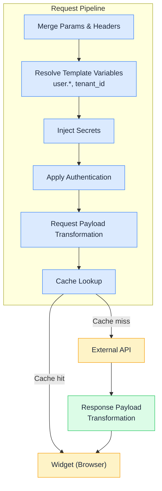
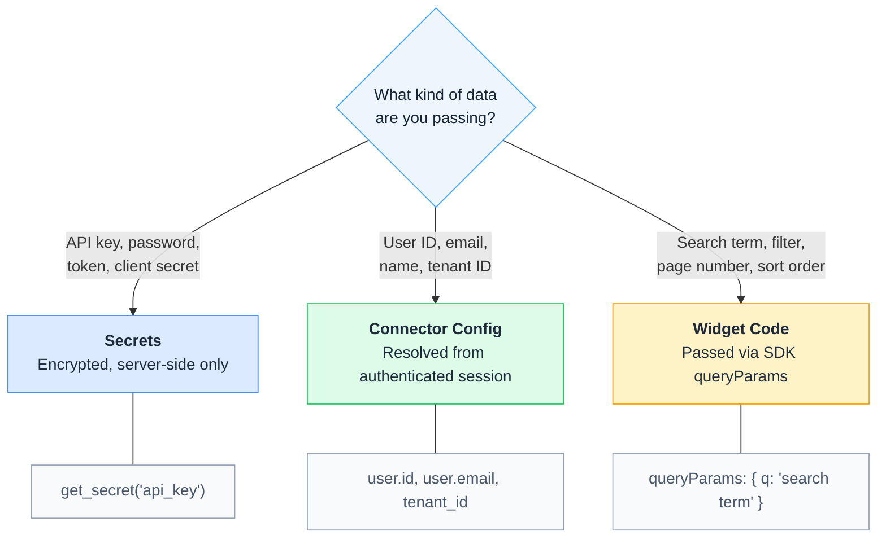

# How Connectors Work

A **connector** is a server-side proxy that sits between your widget and an external API. Every connector request passes through a pipeline of processing stages before reaching the destination, and the response passes through its own pipeline before returning to your widget.

## The pipeline

## Request pipeline

Each stage runs in order before the HTTP request leaves the platform.

**Merge Params & Headers** — The platform combines the connector's configured headers and query parameters with any overrides sent from the widget code. Fields marked as non-overridable cannot be changed by the browser. See [Headers & Query Parameters](headers-and-query-parameters). Connectors can also declare **path parameters** — values the widget supplies per call that get substituted into {{ pathParams.X }} URL template references. See [Dynamic URL Path Segments](dynamic-url-paths).

**Resolve Template Variables** — Template expressions like {{ user.id }} and {{ tenant\_id }} are replaced with values from the authenticated session. These values are resolved on the server — the browser cannot see or tamper with them. See [Template Variables](template-variables) and [Passing User Context](passing-user-context).

**Inject Secrets** — Expressions like {{ get\_secret('api\_key') }} in headers, query parameters, and authentication fields are replaced with encrypted secret values. Secrets are never exposed to the browser. See [Secrets and Variables](secrets/).

**Apply Authentication** — The platform applies the configured authentication method — adding an API key header, exchanging OAuth credentials for a token, or signing a JWT. See [Authentication](authentication).

**Request Payload Transformation** — If a request transformation is configured, the request body is transformed before sending. This lets you reshape data from the widget into the format the external API expects. See [Request Transformation](payload-template).

**Cache Lookup** — For GET and HEAD requests, the platform checks whether a cached response exists before calling the external API. On a cache hit, the cached response is returned directly — the external API is never called. On a cache miss, the request proceeds to the external API and the response is stored for future requests. See [HTTP Caching](http-caching).

## Response pipeline

After the external API responds (on a cache miss), the response passes through one stage before returning to the widget.

**Response Payload Transformation** — If a response template is configured, the response body is transformed before returning to the widget. This lets you filter, reshape, or reformat the API's response. See [Response Transformation](response-transformation).

## Response timeout

Once the request leaves the platform, the external API has 15 seconds to respond. If it does not respond in time, the platform abandons the call and the widget's request fails with `502`, carrying a JSON error envelope whose `errors.scope` is `Downstream (network/external service)`. For a composite connector, that scope is prefixed with the name and index of the step that failed.

## Where data belongs

Different types of data enter the pipeline at different points. Use this decision tree to determine where a value should be configured.

See [Passing User Context](passing-user-context) for the rule on when a value must come from the server rather than the browser, [Secrets and Variables](secrets/) for credential storage, and [Calling from Widget Code](calling-from-widgets) for SDK parameters.

## Next Steps

* [Build Your First Connector](build-first-connector) — Hands-on tutorial to create and call a connector
* [Passing User Context](passing-user-context) — Securely inject user identity into requests
* [Template Variables](template-variables) — Full reference of variables, filters, and functions
