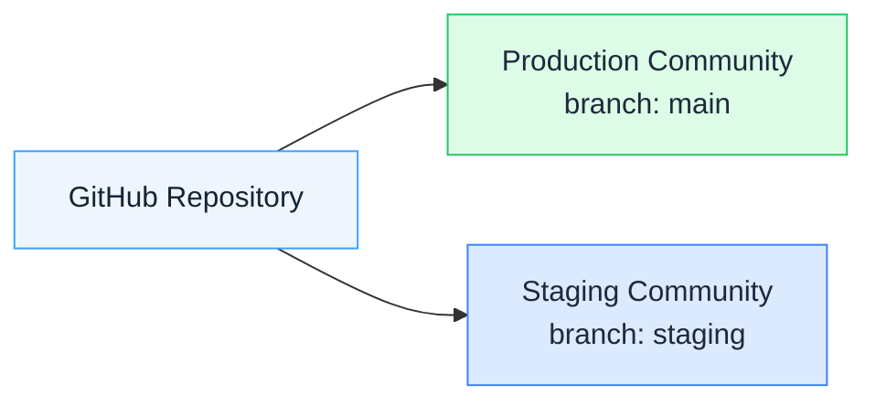
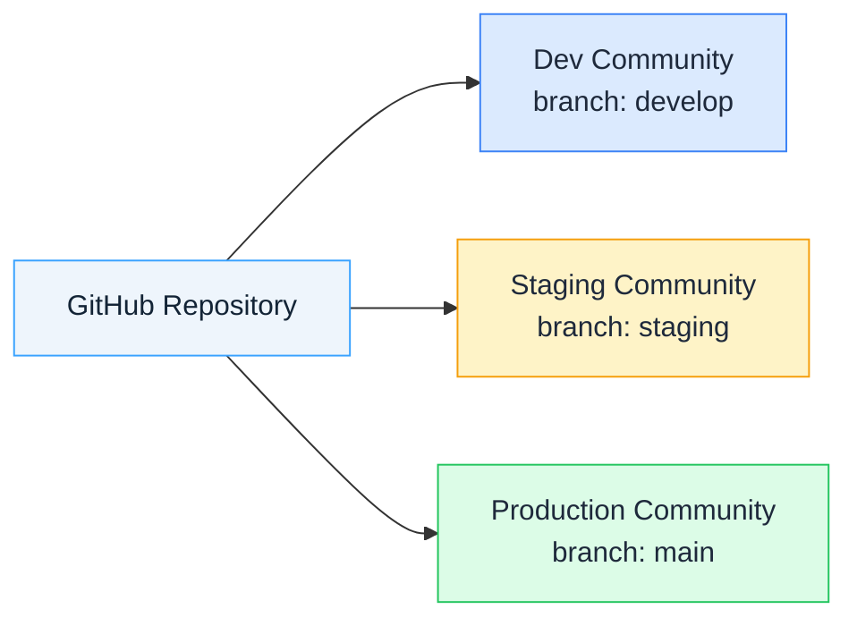

# Preview and Promote

Test widget changes safely before going live by using a separate staging community, then promote by merging to your production branch.

## When to Use This

* You're changing a widget, script, or stylesheet and want to verify it before publishing to production
* You need stakeholder approval before going live
* Your team uses a dev → staging → production workflow

## Prerequisites

* GitHub repository connected and enabled in your production community
* Widgets currently publishing from `main` branch in your production community
* A separate staging community (talk to your Gainsight team if you need one)

::: warning
Changing the watched branch **replaces all existing widgets** from that repository with content from the new branch. This affects all users of the community immediately. For staging or multi-environment workflows, use a **separate community** with the desired branch instead of changing the branch in your current community. Talk to your Gainsight team if you need a separate community for this. See [Preview and Promote](/custom-widgets/recipes/preview-and-promote) for a step-by-step guide.
:::

## Part 1: Preview Changes

### Step 1: Create a Staging Branch

If you don't already have a `staging` branch, create it once:

```bash
git checkout main
git checkout -b staging
git push -u origin staging
```

### Step 2: Make Your Changes

Edit your widget files and push:

```bash
git add .
git commit -m "Update widget styling"
git push
```

### Step 3: Set Up a Staging Community

Instead of switching the branch in your production community, use a **separate community** dedicated to staging:

1. Open your staging community — if you don't have one yet, talk to your Gainsight team about getting one set up
2. Go to **Integrations** → **Developer Studio** → **Sources**
3. Connect the **same GitHub repository** used in production
4. Set the **Watched Branch** to `staging`
5. **Enable** the repository

The system fetches and publishes content from your staging branch into this community. Your production community remains untouched on `main`.



### Step 4: Verify Your Changes

1. Wait for build status to show ✓ (Completed) in the staging community
2. Check the extension in the staging community — add or view a widget in the **No-Code Builder**, or load a page to confirm a script's console output or a stylesheet's visual effect
3. Confirm the changes look correct

### Step 5: Promote to Production

Once approved, merge to `main` and push. Your production community already watches `main`, so it picks up the changes automatically:

```bash
git checkout main
git merge staging
git push
```

No branch switching in production is needed — the merge and push is all it takes. The `staging` branch stays in place for your next change.

## Part 2: Multi-Environment Promotion

::: tip Advanced pattern
This section describes a multi-environment setup using separate communities for each stage. Additional communities are provisioned by Gainsight — talk to your Gainsight team to find out if this option is available for your account.
:::

For teams needing dev → staging → production workflow, use **separate communities per environment** rather than switching branches in a single community.

### Set Up Branch Structure

```bash
git checkout main
git checkout -b staging
git push -u origin staging

git checkout -b develop
git push -u origin develop
```

### Set Up Environment Communities

Set up a dedicated community for each environment. Each community connects the same repository but watches a different branch. Talk to your Gainsight team about setting up additional communities.

**Example setup:**

| Community | Watched Branch | Purpose |
|-----------|---------------|---------|
| Dev Community | `develop` | Active development, internal testing |
| Staging Community | `staging` | QA verification, stakeholder review |
| Production Community | `main` | Live content for all users |

Each community's branch is configured once and stays fixed. You promote by **merging and pushing between branches** — never by switching the watched branch.



### Promotion Workflow

**Develop to Staging:**

```bash
git checkout staging
git merge develop
git push
```

The Staging Community watches `staging` and picks up the changes automatically.

**Staging to Production:**

```bash
git checkout main
git merge staging
git push
git tag v1.2.0
git push --tags
```

The Production Community watches `main` and picks up the changes automatically.

### Example: Complete Feature Cycle

```bash
# 1. Start feature
git checkout develop
git checkout -b feature/new-banner
# ... make changes ...
git commit -m "Add new banner widget"
git push -u origin feature/new-banner

# 2. Merge to develop, verify in Dev Community
git checkout develop
git merge feature/new-banner
git push

# 3. Promote to staging, verify in Staging Community
git checkout staging
git merge develop
git push

# 4. Promote to production (Production Community updates automatically)
git checkout main
git merge staging
git push
```

## Rollback Options

### Before Merge

Production was never changed, so there is nothing to roll back. Revert your changes on `staging`, or don't merge:

```bash
git checkout staging
git revert HEAD
git push
```

> **Note**: This reverts the most recent commit on `staging`. If you pushed multiple commits for this change, run `git log` first to identify the correct commit and revert it by hash instead.

Optionally disable the repository in the staging community.

### After Merge

If changes were already merged to `main`:

```bash
git checkout main
git revert -m 1 HEAD
git push
```

> **Note**: The merge produces a merge commit. `-m 1` tells Git to revert relative to the first parent (`main`), which is required for merge commits.

The Production Community picks up the reverted content automatically.

## Quick Reference

| Goal | Action |
|------|--------|
| Start staging | Push changes to `staging` branch → Staging Community picks them up automatically |
| Approve changes | Merge to `main` → Push (production updates automatically) |
| Reject changes | Don't merge — production was never changed |
| Rollback after merge | `git revert HEAD && git push` |

## Tips

* **Use a dedicated staging community**: Never point your production community at a non-production branch
* **Staging is a permanent setup**: Your staging community and branch stay in place — no need to recreate them for each change
* **Keep feature branches short-lived**: Merge or discard `feature/` branches within a few days to avoid drift
* **Use pull requests**: Better tracking and code review
* **Protect main branch**: Configure GitHub branch protection for reviews

## Related

* [Force Republish](force-republish) — Trigger a rebuild without making a code change
* [Repository & Branch Settings](../v2/repository-settings) — Configure watched branches per repository
* [Build & Publish](../v2/build-and-publish) — Understand the full build and publish pipeline
* [Multiple Organizations](../v2/multiple-organizations) — Connect multiple GitHub orgs
