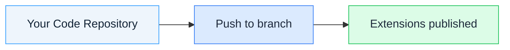

# Extensions

Extensions let you customize your community from code. You declare **widgets**, **scripts**, and **stylesheets** in a single registry file in your Git repository, push to your watched branch, and the platform publishes everything automatically.

## The Three Extension Types

You can publish any combination of the three types — one, two, or all three. They share the same registry file, the same publishing pipeline, and the same page-targeting rules.

| Type | What it is | Scope | When to use |
|------|-----------|-------|-------------|
| [**Widgets**](build-first-widget) | Interactive components placed on pages via the No-Code Builder | One placed instance per page zone | Build tailored UI — forms, dashboards, dynamic content |
| [**Scripts**](scripts-overview) | Global JavaScript injected into the page | Every matching page | Analytics, tracking, shared utilities |
| [**Stylesheets**](stylesheets-overview) | Global CSS injected into the page | Every matching page | Sitewide theming, fonts, design tokens |

## The Registry File

Every extension you publish is declared in a single file at the root of your repository: `extensions_registry.json`. See [Registry Reference](registry-reference) for the root object specification and [Repository Layout](project-setup) for how to structure your repository around it.

## How It Works

1. **Connect** — Link your GitHub organization to the platform.
2. **Configure** — Select which repositories and branches to watch.
3. **Push** — Commit changes to your watched branch.
4. **Publish** — Extensions update within seconds.

For publishing details, see [Build & Publish](build-and-publish) and [Repository & Branch Settings](repository-settings).

## Why Extensions

| For Developers | For Teams |
|----------------|-----------|
| Version control for every change | No manual uploads |
| Pull requests and code review | Instant deployments |
| Branch-based environments | Audit trail via commits |
| Familiar Git workflow | Rollback via Git |

## Branch-Based Environments

Each repository watches one branch at a time per community. Use separate communities to run multiple environments (dev, staging, production) — each watching its own branch.

See [Repository & Branch Settings](repository-settings) and [Preview and Promote](../recipes/preview-and-promote).

## Requirements

See [Connect Your GitHub Account](connect-github) for the GitHub and platform access you need, and [Repository Layout](project-setup) for the required `extensions_registry.json` file.

## Limitations

See [Repository & Branch Settings](repository-settings) for the one-watched-branch-per-community rule, and [Repository Layout](project-setup) for naming extensions uniquely.

## Security

Extension code is scanned for security issues before publishing, and every widget response includes security headers. See [Content Security](content-security) for details.

## Next Steps

Pick the extension you want to build — each type has its own hands-on tutorial:

| You want to build... | Start with |
|----------------------|-----------|
| A custom interactive component | [Your First Widget](build-first-widget) |
| A global script | [Your First Script](first-script) |
| A global stylesheet | [Your First Stylesheet](first-stylesheet) |

New to the platform entirely? [Connect Your GitHub Account](connect-github) first, then return here.

Already familiar with the registry format? Go straight to the [Registry Reference](registry-reference) for the `extensions_registry.json` root object.
