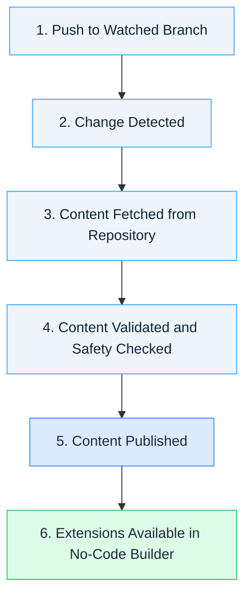

# Build & Publish

Pushing code to your watched branch automatically updates your widgets, scripts, and stylesheets. This page explains the publishing flow and what triggers it.

## Prerequisites

* A connected GitHub organization (see [Connect Your GitHub Account](connect-github))
* At least one enabled repository (see [Repository & Branch Settings](repository-settings))

## How It Works

When you push changes to a watched branch, your extension content is automatically fetched, processed, and published.

## The Push-to-Publish Flow

### 1. Push to Watched Branch

When you push a commit to your repository's watched branch (e.g., `main`), the platform detects the change automatically.

### 2. Change Detection

The platform identifies:

* Which repository was updated
* Which branch received the push
* Whether this branch is being watched

### 3. Content Fetching

If the push was to a watched branch, the platform:

* Fetches the `extensions_registry.json` file from your repository, which declares your widgets, scripts, and stylesheets
* Downloads widget directories defined in `source` blocks
* Downloads script and stylesheet files with relative paths
* Validates the content structure

### 4. Validation and Security Check

Valid content is:

* Scanned for security issues (see [Content Security](content-security))
* Processed and optimized
* Validated against the schema

### 5. Publishing

Validated content is:

* Published to the platform
* Made available in the No-Code Builder and on community pages

> **Note**: If content hasn't changed since the last publish, it will be **skipped** rather than re-uploaded. This is normal and improves performance. You'll see this reflected in the build status details.

### 6. Extensions Available

Your extensions are now:

* Serving new content
* Visible in the No-Code Builder's widget library
* Ready to be placed on pages by community administrators

The entire process from push to availability typically completes within seconds for simple extensions.

## What Triggers Publishing

Extension publishing is automatically triggered by several actions:

| Action | What Happens |
|--------|--------------|
| **Push to watched branch** | New content is fetched and published |
| **Enable a repository** | Current content is immediately published |
| **Change watched branch** | **All extensions replaced** with content from the new branch |
| **Initial connection** | Content is fetched when you first enable a repository |

You don't need to push a new commit after enabling a repository or changing branches — publishing happens automatically. Which branch is watched is configured in [Repository & Branch Settings](repository-settings).

## Branch-Based Content

You choose which branch each repository watches in [Repository & Branch Settings](repository-settings). Each repository watches one branch at a time per community; changing it replaces all extensions from that repo. For multi-environment workflows, use separate communities — each watching its own branch.

**Example workflow with separate communities:**

1. Dev Community watches `develop` — develop extensions there
2. Merge to `staging` and push — Staging Community picks up changes automatically
3. QA team verifies in Staging Community
4. Merge to `main` and push — Production Community picks up changes automatically

For a step-by-step guide, see [Preview and Promote](../recipes/preview-and-promote).

## Build Status

Each publishing attempt shows a status (In Progress, Completed, Warning, Failed) in Sources. A **Warning** status means the build succeeded and your content is live, but advisories — such as deprecation notices — need your attention. Click the status indicator to see the full error details for failed builds or the advisory list for builds with warnings. For what each status means and how to act on it, see [Repository & Branch Settings — Understanding Build Status](repository-settings#step-6-understanding-build-status).

## Troubleshooting

For troubleshooting failed, stuck, or stale builds — including why a push didn't update your extensions, why fewer extensions published than expected, and content that appears out of date — see [Common Issues](common-issues).

## Next Steps

* [Multiple Organizations](multiple-organizations) — Work with multiple GitHub organizations
* [Recipes: Preview and Promote](../recipes/preview-and-promote) — Preview builds before going to production
* [Recipes: Force Republish](../recipes/force-republish) — Trigger a rebuild without a code change
* [Error Codes](error-codes) — Full error reference for build failures
* [Common Issues](common-issues) — Resolve common issues
