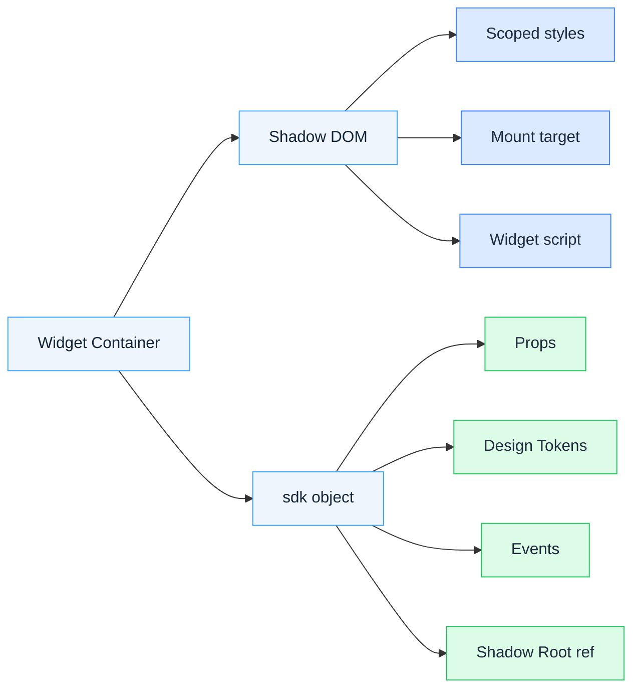
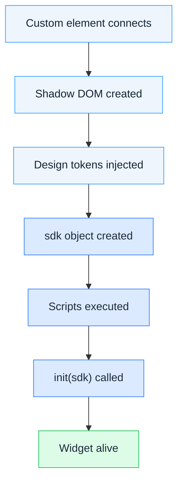
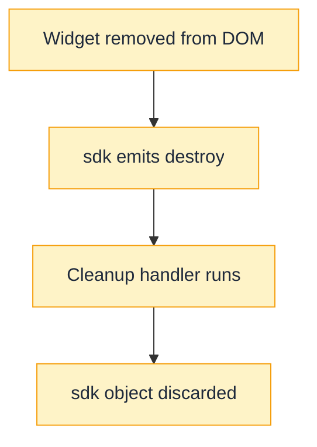

# Widget Runtime

This page explains how custom widgets are loaded, initialized, and managed by the platform. It covers the runtime model that applies to **all** widgets regardless of framework — React, Vue, vanilla JavaScript, or anything else.

## How Widgets Run

Every widget runs inside a **Shadow DOM** that the platform creates for you. The Shadow DOM isolates your widget's styles and markup from the host page. At runtime, the platform also creates the **`sdk` object** that gives your code access to props, events, and the shadow root where your widget renders.

Your widget's entry file is an HTML fragment, not a full document — no `<html>`, `<head>`, or `<body>` tags (see [Your First Widget](build-first-widget)). At the top level it may contain only an inline `<style>` block, your markup, and script tags (inline or `type="module"`); the platform inserts exactly this content into the shadow root it creates.



### Agent guidance: mounting UI and querying DOM

When you write a widget, you are running INSIDE a shadow DOM the platform created. That shadow DOM is unreachable from the top-level `document`. Follow these rules:

**Mounting UI (must / must not):**

* MUST mount your UI into `sdk.getContainer()` (returns the widget's `ShadowRoot`).
* MUST NOT mount into `document.body`, `document.getElementById(...)`, or any global target. The widget only owns its own shadow DOM; the outer page belongs to the host.
* For React: render a mount element into the shadow root first (e.g. `sdk.getContainer().innerHTML = '<div id="root"></div>'`), then call `createRoot(sdk.$('#root'))`. Prefer this over `createRoot(sdk.getContainer())` so React owns a dedicated child instead of the shadow root itself — the platform may inject sibling nodes.
* For vanilla JS: use `sdk.getContainer().innerHTML = ...` or `appendChild(...)` directly.

**Querying DOM inside the widget (must / must not):**

* MUST use `sdk.$(selector)` / `sdk.$$(selector)` to find elements inside your widget.
* MUST NOT use `document.querySelector(...)` — the top-level document cannot see into the widget's shadow DOM; the call returns `null`.
* `sdk.$(selector)` is a shorthand for `shadowRoot.querySelector(selector)` scoped to this widget instance. `sdk.$$(selector)` returns a plain array (not a NodeList).

**The vanilla-JS widget skeleton (canonical shape):**

The example below assumes a widget configured with a `title` prop; substitute your own prop keys. The props shape comes from the widget's `extensions_registry.json` definition — see the Widget Definition Reference.

```javascript
export async function init(sdk) {
  await sdk.whenReady()

  const container = sdk.getContainer()
  container.innerHTML = `
    <div class="card">
      <h1 class="title"></h1>
      <button class="cta">Click</button>
    </div>
  `

  const title = sdk.$('.title')
  const cta = sdk.$('.cta')

  const applyProps = (props) => { title.textContent = props.title ?? '' }
  applyProps(sdk.getProps())
  sdk.on('propsChanged', applyProps)

  const onClick = () => sdk.emit('ctaClicked')
  cta.addEventListener('click', onClick)

  sdk.on('destroy', () => cta.removeEventListener('click', onClick))
}
```

**When you see a different pattern:** `rendering-and-dom.md` shows an IIFE + `new WidgetServiceSDK()` + `document.querySelectorAll('gs-cc-registry-widget[...]')` example. That pattern is for scripts running OUTSIDE a widget instance (e.g. a page script iterating over multiple widget hosts). It is NOT the pattern for code running inside `init(sdk)`. If you are writing `init(sdk)`, use the skeleton above.

## The `init(sdk)` Contract

Every widget must export an `init` function (or a `default` export). The platform calls this function with the `sdk` object after the widget connects to the DOM:

```javascript
export async function init(sdk) {
  await sdk.whenReady()
  // Mount your UI into sdk.getContainer()
}

// OR default export
export default async function (sdk) {
  await sdk.whenReady()
  // Mount your UI into sdk.getContainer()
}
```

Your widget is an ES module. The platform loads it via a `<script type="module">` tag inside the widget's shadow DOM.

`await sdk.whenReady()` must resolve before `getContainer()`, `getProps()`, or `$()` are used, since each of these assumes the `sdk` object has finished initializing — calling them before `whenReady()` resolves is unsupported. In practice, this means awaiting `whenReady()` as the first statement inside `init` whenever a widget uses any of these methods right away.

## Widget Lifecycle

### Initialization

When a widget appears on a page, the platform runs through this sequence:



Once alive, the widget receives `propsChanged` and custom events until it is removed.

### Teardown

When the widget is removed from the page, the `sdk` object emits a `destroy` event. This is where a widget cleans up its UI framework, cancels network requests, clears timers, and removes event listeners.



**Example cleanup:**

```javascript
export function init(sdk) {
  const interval = setInterval(() => fetchData(), 30000)

  sdk.on('destroy', () => {
    clearInterval(interval)
  })
}
```

## Props

Props come from the widget's configuration (set via the **No-Code Builder** or [Widget Definition Reference](widget-schema)). They can be read with `getProps()`, and changes are observed via the `propsChanged` event:

```javascript
const props = sdk.getProps()
console.log(props.title)

sdk.on('propsChanged', (newProps) => {
  console.log('Config updated:', newProps)
})
```

## Design Tokens

Design tokens are CSS custom properties that carry a community's branding — colors, fonts, and other theme values — into a widget's styles. The platform injects them into the widget's shadow DOM automatically, so a widget can reflect each community's look without hardcoding colors or fonts:

```css
h1 {
  color: var(--color-action-primary-default, #9254D9);
}
```

The second argument to `var()` is a fallback value. It matters because a widget can render before a community's branding has loaded, or outside a community context altogether — without a fallback, those cases have no color to fall back on.

See [Use Design Tokens](design-tokens) for usage patterns and [Design Tokens Reference](design-tokens-reference) for the full token catalog.

## Custom Events

Widgets can emit and listen for custom events to communicate with the platform or other widgets:

```javascript
sdk.emit('taskCompleted', { taskId: 42 })

const unsubscribe = sdk.on('taskCompleted', (data) => {
  console.log('Task completed:', data)
})
```

The `on()` method returns an unsubscribe function, called when the listener is no longer needed.

## Best Practices

### Shadow DOM awareness

* `sdk.getContainer()` returns the widget's shadow root, which is why framework apps mount there — passed directly to `createRoot()` (React) or `createApp().mount()` (Vue). For finer control over what the framework owns, `sdk.$('#root')` targets a specific element inside the shadow root instead of the root itself.
* `sdk.$()` and `sdk.$$()` exist because the shadow root is not reachable from the main `document`. They are shorthands for `shadowRoot.querySelector()` and `shadowRoot.querySelectorAll()`, scoped to the widget's own DOM.
* Styles are scoped to the shadow DOM automatically, which is why a widget's CSS never leaks into the host page or collides with another widget's styles.

### Styling

* Design tokens, referenced with `var()`, let a widget's colors and fonts adapt to each community's theme rather than being fixed at build time — see [Use Design Tokens](design-tokens).
* The `:host` selector targets the widget's own container element, which sits outside the widget's regular markup.
* A fallback value on a design token matters because a widget can render before branding has loaded, or outside a community context altogether: `var(--color-action-primary-default, #9254D9)`.

### Bundle size

* A widget's JavaScript is fetched and executed on every page where it appears, which is why tree-shaking aggressively and lazy-loading heavy dependencies with dynamic `import()` keep a widget's footprint small.

### Cleanup

* The `destroy` event exists because the platform does not tear down a widget's framework state or event listeners on removal — that responsibility falls to the widget itself.
* The `on()` return value is an unsubscribe function for exactly this reason: it lets a widget stop listening to SDK events once they are no longer needed.
* Timers and pending requests started during a widget's lifetime need to be cleared in the same `destroy` handler, since nothing else stops them.

## Next Steps

* [Widget Runtime Reference](sdk-api-reference) — Properties, methods, and events on the `sdk` object
* [Use Design Tokens](design-tokens) — Apply community branding to your widget's CSS
* [Design Tokens Reference](design-tokens-reference) — The full token catalog and platform default values
* [Using React](using-react) — Build widgets with React
* [Widget Definition Reference](widget-schema) — Define your widget in `extensions_registry.json`
* [Configurable Widgets](configurable-widgets) — Let editors customize your widget via a form in the **No-Code Builder**
* [Common Issues](common-issues) — Common issues and solutions
* [React widget in the template repository](https://github.com/gainsight-hub/widgets-repository-template/tree/main/widgets/react_widget) — Complete example showing `whenReady()`, `getContainer()`, `getProps()`, `propsChanged`, and `destroy` lifecycle events
