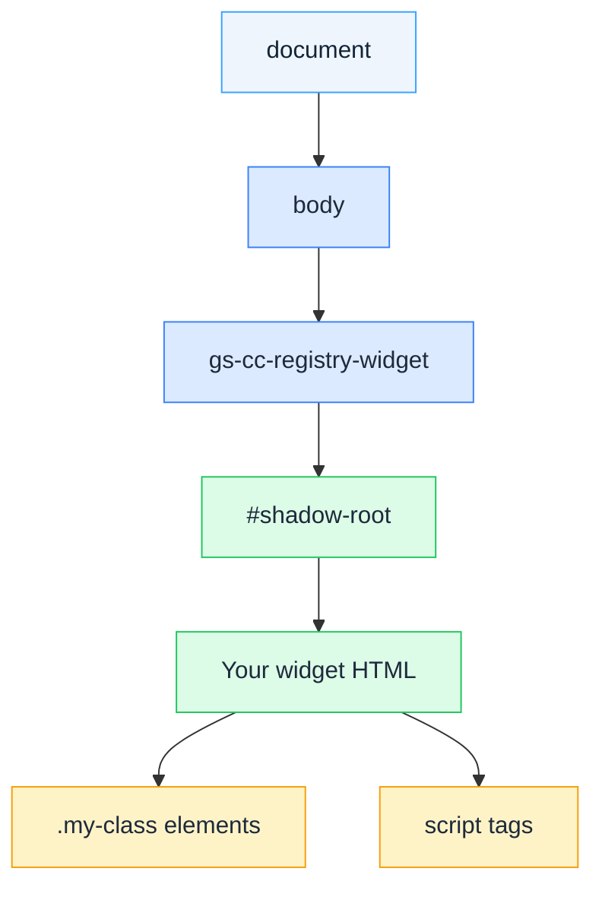

# Rendering & DOM

To read or update your widget's own markup, query through its Shadow DOM host rather than the main `document` — plain `document.querySelector()` calls cannot reach elements inside your widget. Use this guide when your widget needs to manipulate its rendered DOM directly, especially if multiple instances of the same widget type can appear on the same page.

## Overview

Widget HTML, CSS, and JavaScript run inside a `<gs-cc-registry-widget>` custom element that uses **Shadow DOM encapsulation**. Your widget's markup and styles are isolated from the host page and from other widgets.

This encapsulation has important implications:

* Elements inside your widget are **not accessible** from the main document
* `document.querySelector()` cannot reach your widget elements
* `document.currentScript` may be `null` in the widget script context
* Multiple widget instances each have their own Shadow DOM

## Shadow DOM and Host Element

The host element is a `<gs-cc-registry-widget>` custom element that wraps your widget. To access elements inside your widget, query for the host element and access its `shadowRoot`.

**Incorrect — does not work inside a widget:**

```js
// This returns null — document cannot see into Shadow DOM
const el = document.querySelector('.my-class');
```

**Correct — query through the shadow root:**

```js
const hosts = document.querySelectorAll(
  'gs-cc-registry-widget[data-widget-type*="your_widget_type"]'
);
hosts.forEach(function(host) {
  const root = host.shadowRoot;
  if (root) {
    const el = root.querySelector('.my-class');
  }
});
```

Replace `your_widget_type` with the `type` value from your widget's `extensions_registry.json` entry.

The `*=` operator matches widgets whose `data-widget-type` attribute *contains* your type string — this is more robust than exact match (`=`) if the platform adds a prefix or suffix to the attribute value.

Whichever selector you query with — `root.querySelector(...)` here, or `sdk.$()` / `sdk.$$()` inside `init(sdk)` — the selector must match an element that actually exists in your widget's own HTML. A query for a class or ID your markup never defines returns `null` (or an empty array from `$$`) rather than throwing — a typo'd or stale selector fails silently.

## Script Context

`document.currentScript` may be `null` in the widget execution context. This affects patterns like:

```js
// This may fail — document.currentScript can be null in the widget context
window.WIDGET_BASE_URL = document.currentScript.src.replace(/[^/]+$/, '');
```

Do not rely on `document.currentScript` inside widget code. Use the host element approach instead to interact with your widget's DOM.

## Multiple Widget Instances

The same widget type can appear multiple times on a page. If you use `querySelector` (which returns only the **first** match), only one instance updates while the others remain unchanged.

**Incorrect — only updates the first instance:**

```js
const host = document.querySelector('gs-cc-registry-widget[data-widget-type*="weather"]');
```

**Correct — updates all instances:**

```js
const hosts = document.querySelectorAll('gs-cc-registry-widget[data-widget-type*="weather"]');
hosts.forEach(function(host) {
  const root = host.shadowRoot;
  if (root) {
    // Update this instance's DOM
  }
});
```

## DOM Hierarchy



## Full Example

A minimal widget that fetches weather data through a connector and updates its own DOM, combining the patterns above:

::: tip `window.WidgetServiceSDK` vs. the `sdk` parameter
The example below calls `new window.WidgetServiceSDK()` — a global **constructor** your widget code invokes directly, different from the `sdk` parameter passed to `init(sdk)`. See [SDK Concepts](/sdk/concepts) for how the two relate, [Widget Runtime Reference](sdk-api-reference) for the `init(sdk)` parameter, and [Widget SDK](/sdk/widget-sdk/overview) for the global `window.WidgetServiceSDK` constructor.
:::

```html
<!-- index.html — your widget entry file -->
<div class="weather-widget">
  <p class="status">Loading...</p>
  <div class="result" style="display:none">
    <h3 class="city-name"></h3>
    <p class="temperature"></p>
  </div>
</div>

<script>
(async function() {
  // Find ALL instances of this widget type on the page
  const hosts = document.querySelectorAll(
    'gs-cc-registry-widget[data-widget-type*="weather"]'
  );

  for (var i = 0; i < hosts.length; i++) {
    var host = hosts[i];
    var root = host.shadowRoot;
    if (!root) continue;

    // Query elements through the shadow root, not document
    var statusEl = root.querySelector('.status');
    var resultEl = root.querySelector('.result');
    var cityEl   = root.querySelector('.city-name');
    var tempEl   = root.querySelector('.temperature');

    try {
      var sdk = new window.WidgetServiceSDK();
      var data = await sdk.connectors.execute({
        permalink: 'weather-api',
        method: 'GET',
        queryParams: { q: 'Warsaw' }
      });

      cityEl.textContent = data.city;
      tempEl.textContent = data.temperature + '°C';
      statusEl.style.display = 'none';
      resultEl.style.display  = 'block';
    } catch (err) {
      statusEl.textContent = 'Failed to load weather data.';
      console.error('Connector error:', err);
    }
  }
})();
</script>
```

**Key points in this example:**

1. The SDK is loaded automatically by Customer Community and exposed as `window.WidgetServiceSDK` — no script tag is required
2. All host elements are iterated with a `for` loop to safely await each instance
3. Elements are queried through `host.shadowRoot`, not `document`
4. Each instance is updated independently in the loop

## Next Steps

* [Widget Runtime](core-concepts) — The `init(sdk)` contract and SDK API reference
* [Widget Definition Reference](widget-schema) — The `type` field used in querySelector selectors
* [Widget SDK](/sdk/widget-sdk/overview) — SDK reference for the global `window.WidgetServiceSDK` constructor
* [Card Grid widget in the template repository](https://github.com/gainsight-hub/widgets-repository-template/tree/main/widgets/card_grid) — Working example of Shadow DOM manipulation with dynamic content and connector data
