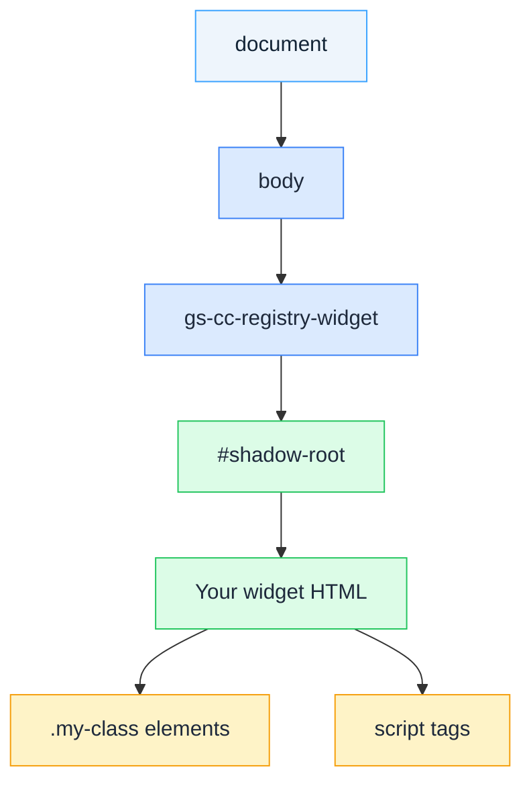

# Rendering & DOM

To read or update your widget's own markup inside `init(sdk)`, query with `sdk.$()` / `sdk.$$()`, which are scoped to your widget's shadow root — plain `document.querySelector()` calls cannot reach elements inside your widget. Use this guide when your widget needs to manipulate its rendered DOM directly, especially if multiple instances of the same widget type can appear on the same page.

## Overview

Widget HTML, CSS, and JavaScript run inside a `<gs-cc-registry-widget>` custom element that uses **Shadow DOM encapsulation**. Your widget's markup and styles are isolated from the host page and from other widgets.

This encapsulation has important implications:

* Elements inside your widget are **not accessible** from the main document
* `document.querySelector()` cannot reach your widget elements
* `document.currentScript` is `null` in widget scripts
* Multiple widget instances each have their own Shadow DOM

## Shadow DOM and Host Element

The host element is a `<gs-cc-registry-widget>` custom element that wraps your widget. Inside widget code, use `sdk.$()` / `sdk.$$()` from `init(sdk)` — they query your widget's own shadow root, so you never touch the host element yourself.

**Incorrect — does not work inside a widget:**

```js
// This returns null — document cannot see into Shadow DOM
const el = document.querySelector('.my-class');
```

**Correct — use `sdk.$()` inside `init(sdk)`, after `await sdk.whenReady()`:**

```js
export async function init(sdk) {
  await sdk.whenReady()
  const el = sdk.$('.my-class')
}
```

**From a page script (outside any widget instance) — query through the shadow root:**

```js
const hosts = document.querySelectorAll(
  'gs-cc-registry-widget[data-widget-type*="your_widget_type"]'
);
hosts.forEach(function(host) {
  const root = host.shadowRoot;
  if (root) {
    const el = root.querySelector('.my-class');
  }
});
```

Replace `your_widget_type` with the `type` value from your widget's `extensions_registry.json` entry. This host-element pattern is only for page scripts; widget code should use `sdk.$()`.

The `*=` operator matches widgets whose `data-widget-type` attribute *contains* your type string — this is more robust than exact match (`=`) if the platform adds a prefix or suffix to the attribute value.

Whichever selector you query with — `root.querySelector(...)` here, or `sdk.$()` / `sdk.$$()` inside `init(sdk)` — the selector must match an element that actually exists in your widget's own HTML. A query for a class or ID your markup never defines returns `null` (or an empty array from `$$`) rather than throwing — a typo'd or stale selector fails silently.

## Script Context

`document.currentScript` is always `null` in widget scripts, so patterns that read `document.currentScript.src` fail. Use `sdk.$()` / `sdk.$$()` inside `init(sdk)` to interact with your widget's DOM, and see [Hosting Widgets](hosting-widgets#javascript-dynamic-loading-limitation) for resolving asset URLs.

## Multiple Widget Instances

The same widget type can appear multiple times on a page. `init(sdk)` runs once per widget instance, and `sdk.$()` is scoped to that instance's shadow root, so each instance updates itself with no host iteration.

**Incorrect — only updates the first instance:**

```js
const host = document.querySelector('gs-cc-registry-widget[data-widget-type*="weather"]');
```

**Correct — each instance runs its own `init(sdk)`:**

```js
export async function init(sdk) {
  await sdk.whenReady()
  // Update this instance's DOM
  sdk.$('.my-class').textContent = 'Updated'
}
```

**From a page script (outside any widget instance) — iterate all hosts:**

```js
const hosts = document.querySelectorAll('gs-cc-registry-widget[data-widget-type*="weather"]');
hosts.forEach(function(host) {
  const root = host.shadowRoot;
  if (root) {
    // Update this instance's DOM
  }
});
```

## DOM Hierarchy


```mermaid
flowchart TD
  A["document"] --> B["body"]
  B --> C["gs-cc-registry-widget"]
  C --> D["#shadow-root"]
  D --> E["Your widget HTML"]
  E --> F[".my-class elements"]
  E --> G["script tags"]

  style A fill:#eef5fc,stroke:#39a2ff,color:#132436
  style B fill:#dbeafe,stroke:#3b82f6,color:#1e293b
  style C fill:#dbeafe,stroke:#3b82f6,color:#1e293b
  style D fill:#dcfce7,stroke:#22c55e,color:#1e293b
  style E fill:#dcfce7,stroke:#22c55e,color:#1e293b
  style F fill:#fef3c7,stroke:#f59e0b,color:#1e293b
  style G fill:#fef3c7,stroke:#f59e0b,color:#1e293b
```

## Full Example

A minimal widget that fetches weather data through a connector and updates its own DOM, combining the patterns above:

Inside `init(sdk)`, `sdk.$()` already queries your widget's own shadow root, and `sdk.connectors` calls the connector. See [Widget Runtime Reference](/sdk/runtime-reference) for the `init(sdk)` object and [Connectors SDK](/sdk/connectors-sdk/overview) for `sdk.connectors`.

```html
<!-- index.html — your widget entry file -->
<div class="weather-widget">
  <p class="status">Loading...</p>
  <div class="result" style="display:none">
    <h3 class="city-name"></h3>
    <p class="temperature"></p>
  </div>
</div>

<script type="module">
  // runs once per widget instance
  export async function init(sdk) {
    await sdk.whenReady()

    const statusEl = sdk.$('.status')
    const resultEl = sdk.$('.result')
    const cityEl = sdk.$('.city-name')
    const tempEl = sdk.$('.temperature')

    try {
      const data = await sdk.connectors.execute({
        permalink: 'weather-api',
        method: 'GET',
        queryParams: { q: 'Warsaw' }
      })

      cityEl.textContent = data.city
      tempEl.textContent = data.temperature + '°C'
      statusEl.style.display = 'none'
      resultEl.style.display = 'block'
    } catch (err) {
      statusEl.textContent = 'Failed to load weather data.'
      console.error('Connector error:', err)
    }
  }
</script>
```

**Key points in this example:**

1. `init(sdk)` runs once per widget instance, so each instance updates its own DOM independently
2. `sdk.connectors` is available on the `sdk` object — no script tag, import, or construction is required
3. Elements are queried with `sdk.$()`, which is scoped to the widget's shadow root, not `document`

## Next Steps

* [Widget Runtime](core-concepts) — The `init(sdk)` contract and SDK API reference
* [Widget Definition Reference](widget-schema) — The `type` field used in querySelector selectors
* [Connectors SDK](/sdk/connectors-sdk/overview) — Reference for `sdk.connectors`
* [Card Grid widget in the template repository](https://github.com/gainsight-hub/widgets-repository-template/tree/main/widgets/card_grid) — Working example of Shadow DOM manipulation with dynamic content and connector data
