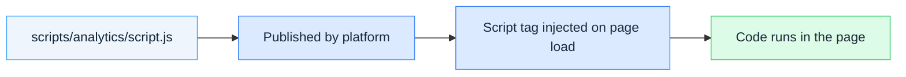

# Scripts Overview

Scripts are JavaScript files that run across your community pages, independent of individual widgets. Use them for analytics, tracking, shared utilities, or any page-level behavior that applies globally instead of to one widget at a time.

## How Scripts Work

Each script you declare in the `scripts` array of `extensions_registry.json` becomes a `<script>` tag injected into every matching page of your community. The platform publishes the file from your repository (or loads it from an external URL) and inserts the tag at the location you choose.

## Scripts vs Widgets

| Aspect | Widget | Script |
|--------|--------|--------|
| Scope | One component in one page zone | The whole page, every matching page |
| Placement | Chosen in the No-Code Builder | Declared via `placement` field |
| Isolation | Shadow DOM | Runs directly on the page |
| Configuration | Per-instance via No-Code Builder | Same for every page that loads it |
| Use cases | Interactive UI, forms, dashboards | Analytics, tracking, shared utilities |

Widgets exist to give community admins something to place and configure. Scripts exist to run page-level code that doesn't belong to any single widget.

## Where Scripts Run

Scripts are injected at one of three locations, controlled by the `placement` field:

| Placement | Location | Use case |
|-----------|----------|----------|
| `head` (default) | Inside `<head>` | Analytics, early initialization, scripts that need to run before content renders |
| `bodyStart` | Start of `<body>` | Scripts that need the DOM to start loading but should run early |
| `bodyEnd` | End of `<body>` | Non-critical scripts that depend on page content being fully loaded |

## Repository-Hosted vs External

Each script has a `path` field. Two shapes are supported:

* **Repository path** (e.g. `scripts/analytics/script.js`) — the file lives in your repository and the platform publishes it.
* **External URL** (e.g. `https://cdn.example.com/tracker.js`) — the tag loads directly from that URL. The platform does not fetch or publish it.

## Conditional Loading

By default, a script loads on every page of your community. Use the `rules` field to load a script only when the current page matches conditions like a specific page type, locale, or authenticated user. See [Page Targeting](page-targeting) for the full rule language.

## Next Steps

* [Your First Script](first-script) — hands-on tutorial from scratch to published script
* [Script Definition Reference](scripts) — every field and option
* [Page Targeting](page-targeting) — conditional loading rules
* [Registry Reference](registry-reference) — where scripts fit in the registry file
