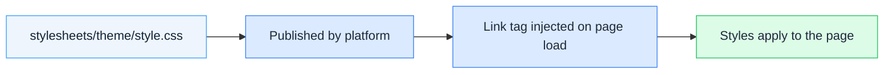

# Stylesheets Overview

Stylesheets are CSS files that apply across your community pages, independent of individual widgets. Use them for shared design tokens, component styles, custom fonts, or any sitewide theming that shouldn't live inside a single widget.

## How Stylesheets Work

Each stylesheet you declare in the `stylesheets` array of `extensions_registry.json` becomes a `<link rel="stylesheet">` tag injected into every matching page of your community. The platform publishes the file from your repository (or loads it from an external URL) and inserts the tag at the location you choose.

## Stylesheets vs Widget Styles

| Aspect | Widget styles | Global stylesheet |
|--------|---------------|-------------------|
| Scope | Inside the widget's Shadow DOM | The whole page |
| Reach | Only affects the widget's own markup | Affects every element on matching pages |
| Isolation | Isolated from the page by Shadow DOM | Runs directly against page HTML |
| Use cases | A single component's appearance | Sitewide theming, fonts, design tokens, cross-page overrides |

Widget styles are scoped and isolated. Global stylesheets reach the whole page and every widget on it — including the community's own built-in elements.

## Where Stylesheets Load

Stylesheets are injected at one of three locations, controlled by the `placement` field:

| Placement | Location | Use case |
|-----------|----------|----------|
| `head` (default) | Inside `<head>` | Fonts, critical styles, anything that must apply before content renders |
| `bodyStart` | Start of `<body>` | Stylesheets that depend on the DOM starting to load |
| `bodyEnd` | End of `<body>` | Non-critical styles loaded after page content |

## Repository-Hosted vs External

Each stylesheet has a `path` field. Two shapes are supported:

* **Repository path** (e.g. `stylesheets/theme/style.css`) — the file lives in your repository and the platform publishes it.
* **External URL** (e.g. `https://fonts.example.com/inter.css`) — the tag loads directly from that URL. The platform does not fetch or publish it.

## Conditional Loading

By default, a stylesheet loads on every page of your community. Use the `rules` field to load a stylesheet only when the current page matches conditions like a specific page type, locale, or authenticated user. See [Page Targeting](page-targeting) for the full rule language.

## Next Steps

* [Your First Stylesheet](first-stylesheet) — hands-on tutorial from scratch to published stylesheet
* [Stylesheet Definition Reference](stylesheets) — every field and option
* [Page Targeting](page-targeting) — conditional loading rules
* [Registry Reference](registry-reference) — where stylesheets fit in the registry file
