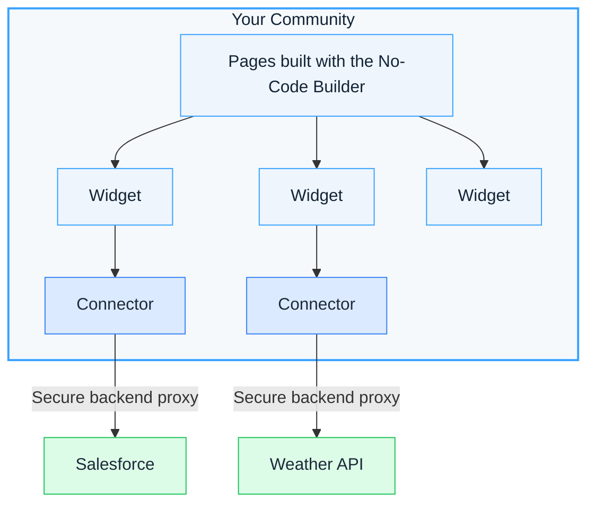

# Key Concepts

Developer Studio is built around a small set of interconnected ideas. Understanding how they relate helps you make better decisions as you build. This page explains each concept and why it works the way it does.

## Extension

An **Extension** is anything you publish to your community from a code repository. There are three kinds — **widgets**, **scripts**, and **stylesheets** — and you declare all of them in a single file, `extensions_registry.json`, at the root of your repository. They share one registry, one publishing pipeline, and one set of page-targeting rules, so you ship any combination you need.

The three types differ in what they do: a widget is a placed, configurable component; a script is global JavaScript; a stylesheet is global CSS. The sections below define each in turn.

[Extensions](/custom-widgets/v2/)

## Widget

A self-contained component that appears on a community page. Widgets can display text, images, charts, forms, or any HTML content. They are placed onto pages using the **No-Code Builder**.

Widgets can be **built-in** (provided by the platform) or **custom** (created by your team from HTML/CSS/JS code stored in a Git repository). Custom widgets run inside Shadow DOM, which isolates their styles and markup from the rest of the page — so your widget's CSS never conflicts with the community theme, and the theme never overrides your styles.

## Script

A **script** is global JavaScript that runs across your community pages, independent of any single widget. Where a widget is one component in one page zone, a script applies to every matching page — use it for analytics, tracking, or shared utilities. You declare each script in the `scripts` array of `extensions_registry.json` and choose where it loads on the page.

[Scripts Overview](/custom-widgets/v2/scripts-overview)

## Stylesheet

A **stylesheet** is global CSS that applies across your community pages, independent of any single widget. Unlike a widget's styles — which stay isolated inside its Shadow DOM — a global stylesheet reaches the whole page and every element on it, so use it for sitewide theming, fonts, and design tokens. You declare each stylesheet in the `stylesheets` array of `extensions_registry.json`.

[Stylesheets Overview](/custom-widgets/v2/stylesheets-overview)

## No-Code Builder

The visual editor inside your community. Community managers use it to drag and drop widgets onto pages, rearrange them, and configure their settings — all without writing code.

When a custom widget is published, it automatically appears in the No-Code Builder's widget library, ready to be added to any page.

## Connector

A secure, reusable configuration for calling an external API. Widget code runs in the browser, so making API calls directly would expose API keys and tokens to anyone using your community. Connectors solve this by routing requests through the platform's backend, where secrets are injected server-side — the browser never sees the credentials.

Each connector defines a **destination URL**, an **HTTP method**, **authentication** settings, and optional **headers**, **query parameters**, and **payload templates**. Once created, you call a connector from widget code using its unique **permalink**. The platform handles the rest: resolving secrets, applying authentication, forwarding the request, and returning the response.

[Learn more about Connectors](/connectors/)

## Secret

A securely stored credential — such as an API key, token, or client secret — that connectors use for authentication. Secrets are managed through the platform UI and referenced in connector configurations using the `get_secret()` function in [Jinja2](https://jinja.palletsprojects.com/) templates. They are never exposed to the browser.

[Secrets and Variables](/connectors/secrets/)

## Variable

A reusable, plain-text configuration value — such as a base URL, environment identifier, or instance ID — that connectors use for non-sensitive settings. Variables are managed through the platform UI and referenced in connector configurations using the `get_variable()` function in [Jinja2](https://jinja.palletsprojects.com/) templates. Unlike secrets, variables are visible and can be used in a connector's URL, so you can point the same connector at different environments. Never store credentials in a variable.

[Secrets and Variables](/connectors/secrets/#variables)

## SDK (Widget SDK)

A JavaScript library that widget code uses to interact with the platform. Its primary use is calling connectors from inside a widget — a call like `sdk.connectors.execute(...)` runs a connector and returns its response, so the browser never sees your credentials.

[SDK](/sdk/)

## Extensions Registry

The `extensions_registry.json` file at the root of your code repository. It declares every Extension you publish — the **widgets**, **scripts**, and **stylesheets** in that repository — in three top-level arrays. Each array is optional, so you publish only the types you need.

```json
{
  "widgets": [ ... ],
  "scripts": [ ... ],
  "stylesheets": [ ... ]
}
```

For the full field specification of each entry type, see the [Registry Reference](/custom-widgets/v2/registry-reference).

## Publishing Pipeline

The automated process that turns code in your repository into live Extensions. When you push to a watched branch, the platform detects the change, fetches your files, validates them against security rules, and publishes them — typically in seconds. This push-to-publish model means there is no manual deploy step: your Git workflow *is* your deployment workflow. The trade-off is that anything pushed to the watched branch goes live immediately, which is why separate staging communities exist for pre-production testing.

[Build & Publish](/custom-widgets/v2/build-and-publish)

## Content Security

Because custom Extensions run real code inside your community, the platform checks every push for security issues before publishing. Scans detect patterns like crypto mining, data exfiltration, phishing, obfuscated code, and exposed credentials. Builds that contain flagged content are rejected — previously published content remains live until a clean push succeeds. This means a bad push never takes down existing widgets; it blocks the update.

[Content Security](/custom-widgets/v2/content-security)

## Permalink

A URL-friendly identifier automatically generated from a connector's name. For example, a connector named "Weather API" gets the permalink `weather-api`. You use this permalink when calling the connector from widget code.

## Branch-Based Environments

A workflow where different Git branches serve different versions of your Extensions to different communities. Each repository watches one branch at a time per community — switching the branch replaces all Extensions from that repository. Use separate communities (dev, staging, production) to run multiple environments from the same repository without interfering with each other.

::: warning Production impact
Changing the watched branch takes effect immediately for all users of that community. Never switch the watched branch to test changes — use a separate staging community instead.
:::

[Preview and Promote](/custom-widgets/recipes/preview-and-promote)

## How It All Fits Together

A typical workflow touches most of these concepts: you define a **widget** in the **Extensions Registry**, push to a watched branch, the **Publishing Pipeline** validates and publishes it, and it appears in the **No-Code Builder**. If the widget needs external data, you create a **Connector** with **Secrets** for authentication and call it via the **SDK**. **Branch-Based Environments** let you preview safely before going live, and **Content Security** ensures nothing harmful reaches your community.



## Next Steps

* [Your First Widget](/custom-widgets/v2/build-first-widget) — hands-on widget tutorial
* [Your First Script](/custom-widgets/v2/first-script) — hands-on script tutorial
* [Your First Stylesheet](/custom-widgets/v2/first-stylesheet) — hands-on stylesheet tutorial
* [Build Your First Connector](/connectors/build-first-connector) — hands-on tutorial for connectors
* [Extensions](/custom-widgets/v2/) — all guides and reference for widgets, scripts, and stylesheets
* [Connectors](/connectors/) — all guides and reference for external API integration
* [Registry Reference](/custom-widgets/v2/registry-reference) — the `extensions_registry.json` root object
